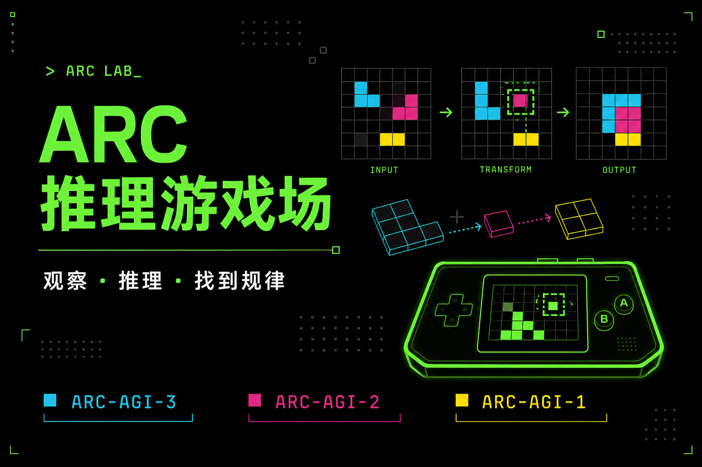
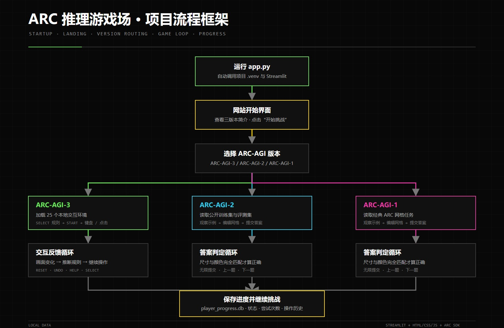

[使用说明.md](https://github.com/user-attachments/files/28929463/default.md)
# ARC-AGI 推理游戏使用说明

## 项目海报



## 项目流程框架图



[点击单独查看项目流程框架图](./project_flow_chart.jpg)

流程从运行 `app.py` 开始，经过网站开始界面和版本选择，分别进入 ARC-AGI-3 交互反馈循环或 ARC-AGI-1/2 答案判定循环，最后统一保存进度并继续挑战。

## 1. 为什么做这个项目？想解决什么问题？

这个项目使用 Streamlit 制作了一个中文 ARC-AGI 推理游戏平台，将 ARC-AGI-1、ARC-AGI-2 和 ARC-AGI-3 三类任务集中在同一个网页中。

项目希望解决以下问题：

- 原始 ARC-AGI 任务网站以英文为主，初次接触时不容易理解操作方式。
- ARC-AGI-1、ARC-AGI-2 和 ARC-AGI-3 的交互形式不同，分别打开和操作不方便。
- JSON 网格数据不适合直接阅读，需要转换成可以观察、点击和编辑的图形界面。
- ARC-AGI-3 的规则需要玩家自行推理，因此为每种题目增加了简短中文提示，但不会直接给出答案。

最终网站提供统一的版本切换入口、中文界面、本地数据、答题编辑器、进度记录和 ARC-AGI-3 游戏机式操作界面。

## 2. 打开页面后怎么操作？点哪些、输入什么？

### 启动网站

在项目目录运行：

```powershell
python "D:\程序设计与科学计算\app.py"
```

`app.py` 会自动使用项目中的 `.venv` 启动 Streamlit，并打开网站。默认地址为：

```text
http://127.0.0.1:8501
```

如果浏览器没有自动打开，可手动访问该地址。启动窗口需要保持运行，关闭窗口会停止网站。

### 切换任务版本

页面顶部有三个版本按钮：

- `ARC-AGI-3`：交互式推理游戏。
- `ARC-AGI-2`：较新的网格转换任务。
- `ARC-AGI-1`：经典网格转换任务。

点击对应按钮即可切换页面。

### ARC-AGI-3 操作方法

1. 点击游戏画面中的 `START` 开始当前题目。
2. 点击游戏机上的 `SELECT` 打开题目列表。
3. 点击某个题目 ID 后，下方只显示该题目的简单规则。
4. 确认规则后点击“确认选择”切换题目；点击“取消”则不切换。
5. 根据当前题目支持的操作使用方向键、空格键或点击画面。不可用的按钮会自动禁用。
6. `RESET` 用于重置当前题目。
7. `UNDO` 或键盘 `Z` 用于撤销上一步。
8. `HELP` 用于查看通用操作帮助。

规则说明只介绍目标和操作方向，不会直接提供解题步骤。玩家仍需观察每次操作后的画面变化，推断真正的规律。

### ARC-AGI-1 和 ARC-AGI-2 操作方法

1. 左侧“示例”区域展示若干输入和正确输出，用来推断转换规律。
2. 右侧“测试”区域展示需要作答的输入网格和输出网格。
3. 使用颜色按钮选择颜色。
4. 使用“编辑”“选择”或“填充”工具修改输出网格。
5. 可点击“复制输入”“清空”“重置”或“调整尺寸”。
6. 完成后点击“提交答案”。提交次数不限，系统会提示答案是否正确。
7. 点击“上一题”或“下一题”切换任务，也可在侧边栏中选择数据集和任务 ID。

## 3. 游戏规则

### ARC-AGI-1 和 ARC-AGI-2 通用规则

1. 每道题由若干“训练示例”和一个或多个“测试输入”组成。
2. 每组训练示例都给出输入网格和正确输出网格。玩家需要比较颜色、形状、数量、位置、方向、对称、移动、复制、裁剪或填充等变化，推断同一条转换规律。
3. 将推断出的规律应用到测试输入，在右侧绘制测试输出。不能只照抄某个训练输出。
4. 输出网格的行数和列数也是答案的一部分，需要根据示例判断是否调整尺寸。
5. 网格使用十种 ARC 标准颜色，颜色编号为 `0-9`。相同编号表示相同颜色。
6. 提交时，输出网格的尺寸、每个格子的位置和颜色必须与标准答案完全一致才算正确。
7. 提交次数不限。答案错误后可以继续观察示例、修改网格并再次提交。
8. 不同测试项相互独立；切换题目后，当前输出和提交状态会按新题目重新初始化。

### ARC-AGI-3 通用规则

1. ARC-AGI-3 不直接给出完整解法，需要根据初始画面和每次操作后的反馈推断目标。
2. 不同题目支持的动作不同，包括方向键、空格键和画面点击；不可用的按钮会自动禁用。
3. 完成当前关卡后会进入下一关，完成该题全部关卡才算完成整个题目。
4. 操作失误时可以使用 `UNDO` 撤销，或使用 `RESET` 重置当前题目。
5. 简单规则只说明目标方向，不代表完整答案，具体移动顺序和隐藏条件仍需自行探索。

### ARC-AGI-3 各题规则

| 题目 ID | 简单规则 |
| --- | --- |
| `ar25` | 控制角色探索蓝色场景，利用移动、交互和点击绕过障碍，最终到达黄色出口。 |
| `bp35` | 控制角色在平台间移动并处理机关；收集安全目标、避开危险物，找到通往下一关的路线。 |
| `cd82` | 观察彩色方块与容器的位置关系，通过移动、交互或点击把方块放到符合规律的位置。 |
| `cn04` | 移动白色角色并与彩色物体交互；根据颜色和形状线索完成当前场景要求。 |
| `dc22` | 操纵小型角色或物体穿过黑色场地，避开障碍，并让关键物体到达对应目标区域。 |
| `ft09` | 观察左侧图案的颜色和位置变化，点击右侧选项中符合相同规律的答案。 |
| `g50t` | 移动两端的彩色连接点，调整路径，使相同颜色或对应端点正确连通。 |
| `ka59` | 在灰色区域中移动绿色方块，利用墙体和机关，把它送到黑色方框目标。 |
| `lf52` | 点击网格单元，依据绿色标记的分布规律改变或选择格子，完成指定图案。 |
| `lp85` | 观察各行颜色序列与箭头提示，点击正确颜色或位置，使输出符合隐藏的转换规律。 |
| `ls20` | 使用方向键在迷宫中移动蓝色角色，收集必要物品并避开障碍，抵达目标位置。 |
| `m0r0` | 通过移动、交互和点击调整大型彩色图形，使其姿态或部件满足关卡给出的目标。 |
| `r11l` | 点击并调整连接杆的方向或长度，让杆端依次接触正确的彩色目标。 |
| `re86` | 移动彩色十字线并结合点击，使横线、竖线或交点与场景中的目标对齐。 |
| `s5i5` | 观察稀疏物体的颜色、形状和位置，点击正确对象或出口，完成对应关系。 |
| `sb26` | 观察上方颜色顺序与中间槽位，选择下方颜色并按正确次序填入或提交。 |
| `sc25` | 移动场景中的角色和方块，利用墙壁规划路线，把彩色物体送到对应目标。 |
| `sk48` | 控制发射器或移动装置，并按下方颜色顺序处理物体，使它们沿正确路线到达目标。 |
| `sp80` | 在橙色场地中移动并操作机关，沿可行路径连接蓝色与黄色区域或抵达出口。 |
| `su15` | 点击场景中的物体或轨迹节点，推断移动顺序，让目标沿正确路线到达终点。 |
| `tn36` | 点击棋盘上的黄色棋子并选择目标格，依据其移动规律到达指定位置。 |
| `tr87` | 观察青色与粉色符号的对应关系，使用方向键选择或排列出符合示例的符号序列。 |
| `tu93` | 使用方向键控制蓝色方块穿过黑白迷宫，避开阻挡并到达绿色终点。 |
| `vc33` | 点击灰色图形中的关键位置，依据黑、白、黄色块的结构补全或匹配目标形状。 |
| `wa30` | 控制蓝色标记在灰白区域中移动，调整线段方向并把分散路径正确连接起来。 |

## 4. 需要准备什么数据？有哪些注意事项？

### 运行环境

- Windows 系统。
- Python 3.11 或 Python 3.12。
- 项目目录中的 `.venv` 虚拟环境和 `requirements.txt` 依赖。

如果 `.venv` 不存在，需要先执行：

```powershell
cd "D:\程序设计与科学计算"
py -3.12 -m venv .venv
.\.venv\Scripts\python -m pip install -r requirements.txt
```

### 数据文件

- `data/`：ARC-AGI-1 和 ARC-AGI-2 的公开训练集与评测集。
- `environment_files/`：25 个 ARC-AGI-3 本地游戏环境。
- `arc_game/arc3_rules.py`：ARC-AGI-3 每种题目的中文规则说明。
- `THIRD_PARTY_LICENSES/`：第三方数据和代码许可证。

正常游玩不需要联网。不要随意删除或移动以上目录，否则对应任务可能无法加载。

### 注意事项

- 网站默认使用 `8501` 端口。如果端口已被占用，应先关闭旧的 Streamlit 进程。
- ARC-AGI-3 首次进入某个题目时会进行本地预加载，之后点击 `START` 会快速显示画面。
- ARC-AGI-1 和 ARC-AGI-2 会把答题进度保存在项目目录的 `player_progress.db` 中。
- 若页面仍显示旧内容，可刷新浏览器或关闭旧标签页后重新打开。
- 不要修改题目 JSON、ARC-AGI-3 环境源码或许可证文件。

## 5. 数据来源与参考链接

本项目使用的是公开 ARC-AGI 数据和官方工具。数据仅用于学习、课程展示和推理游戏实现。

### ARC-AGI-1

- 数据来源：François Chollet 发布的 ARC-AGI 开源数据集。
- GitHub：https://github.com/fchollet/ARC-AGI
- 本项目位置：`data/arc_agi_1/`
- 参考任务页面：https://arcprize.org/tasks/6150a2bd

### ARC-AGI-2

- 数据来源：ARC Prize 发布的 ARC-AGI-2 公开数据集。
- GitHub：https://github.com/arcprize/ARC-AGI-2
- 官方介绍：https://arcprize.org/arc-agi/2
- 本项目位置：`data/arc_agi_2/`

### ARC-AGI-3

- 数据来源：ARC Prize 官方 ARC-AGI SDK 和公开游戏环境。
- SDK GitHub：https://github.com/arcprize/ARC-AGI
- 官方网站：https://three.arcprize.org
- 参考任务页面：https://arcprize.org/tasks/lp85
- 本项目位置：`environment_files/`

### ARC Prize

- ARC Prize 官网：https://arcprize.org
- ARC Prize GitHub：https://github.com/arcprize

### 开源许可证

各数据集和上游项目的许可证文件保存在：

```text
THIRD_PARTY_LICENSES/
```

使用或传播项目中的数据与环境文件时，应同时遵守对应上游项目的许可证和使用要求。
